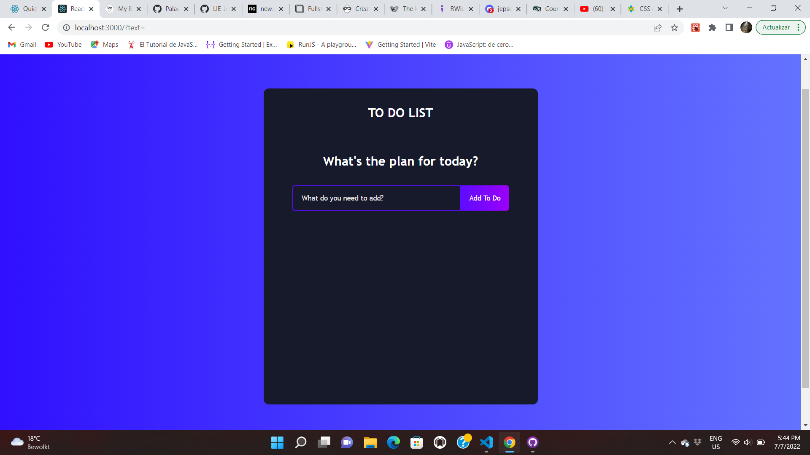

### Getting Started with React

This project is based on the basics of React.
In my application, you are able to:

- Add events or tasks
- Edit your to dos
- Delete your to dos

.png>) .png>)

You can go ahead and try it out by yourself!

Click on the link below
[Todo React](https://sunny-froyo-307bf6.netlify.app)
